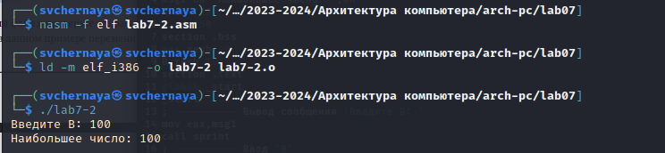

---
## Front matter
title: "Отчёт по лабораторной работе №7"
subtitle: "Дисциплина: архитектура компьютеров и операционные системы"
author: "Черная София Витальевна"

## Generic otions
lang: ru-RU
toc-title: "Содержание"

## Bibliography
bibliography: bib/cite.bib
csl: pandoc/csl/gost-r-7-0-5-2008-numeric.csl

## Pdf output format
toc: true # Table of contents
toc-depth: 2
lof: true # List of figures
lot: true # List of tables
fontsize: 12pt
linestretch: 1.5
papersize: a4
documentclass: scrreprt
## I18n polyglossia
polyglossia-lang:
  name: russian
  options:
	- spelling=modern
	- babelshorthands=true
polyglossia-otherlangs:
  name: english
## I18n babel
babel-lang: russian
babel-otherlangs: english
## Fonts
mainfont: PT Serif
romanfont: PT Serif
sansfont: PT Sans
monofont: PT Mono
mainfontoptions: Ligatures=TeX
romanfontoptions: Ligatures=TeX
sansfontoptions: Ligatures=TeX,Scale=MatchLowercase
monofontoptions: Scale=MatchLowercase,Scale=0.9
## Biblatex
biblatex: true
biblio-style: "gost-numeric"
biblatexoptions:
  - parentracker=true
  - backend=biber
  - hyperref=auto
  - language=auto
  - autolang=other*
  - citestyle=gost-numeric
## Pandoc-crossref LaTeX customization
figureTitle: "Рис."
tableTitle: "Таблица"
listingTitle: "Листинг"
lofTitle: "Список иллюстраций"
lotTitle: "Список таблиц"
lolTitle: "Листинги"
## Misc options
indent: true
header-includes:
  - \usepackage{indentfirst}
  - \usepackage{float} # keep figures where there are in the text
  - \floatplacement{figure}{H} # keep figures where there are in the text
---

# Цель работы

Изучение команд условного и безусловного переходов. Приобретение навыков написания
программ с использованием переходов. Знакомство с назначением и структурой файла
листинга.

# Задание

1. Реализация переходов в NASM.
2. Изучение структуры файлы листинга.
3. Задания для самостоятельной работы.


# Теоретическое введение

Для реализации ветвлений в ассемблере используются так называемые команды передачи
управления или команды перехода. Можно выделить 2 типа переходов:

• условный переход – выполнение или не выполнение перехода в определенную точку
программы в зависимости от проверки условия.

• безусловный переход – выполнение передачи управления в определенную точку программы без каких-либо условий.

Безусловный переход выполняется инструкцией jmp. Инструкция cmp является одной из инструкций, которая позволяет сравнить операнды и
выставляет флаги в зависимости от результата сравнения.
Инструкция cmp является командой сравнения двух операндов и имеет такой же формат,
как и команда вычитания.

Листинг (в рамках понятийного аппарата NASM) — это один из выходных файлов, создаваемых транслятором. Он имеет текстовый вид и нужен при отладке программы, так как
кроме строк самой программы он содержит дополнительную информацию.

# Выполнение лабораторной работы
С помощью утилиты mkdir создаю директорию, в которой буду создавать файлы с программами для лабораторной работы №7 (рис. [-@fig:001]). Перехожу в созданный каталог с помощью утилиты cd.

{ #fig:001 width=70% }

С помощью утилиты touch создаю файл lab7-1.asm (рис. [-@fig:002]).

{ #fig:002 width=70% }

Копирую в текущий каталог файл in_out.asm с помощью утилиты cp, т.к. он будет использоваться в других программах (рис. [-@fig:003]).

{ #fig:003 width=70% }

Ввожу в файл lab7-1.asm текст программы из листинга 7.1. (рис. [@fig:004]).

{#fig:004 width=70%}

Создаю исполняемый файл и запускаю его. (рис. [@fig:005]).

{#fig:005 width=70%}

Таким образом, использование инструкции jmp _label2 меняет порядок исполнения
инструкций и позволяет выполнить инструкции начиная с метки _label2, пропустив вывод
первого сообщения.

Изменю программу таким образом, чтобы она выводила сначала ‘Сообщение № 2’, потом ‘Сообщение № 1’ и завершала работу. Для этого изменяю текст программы в соответствии с листингом 7.2. (рис. [@fig:006]).

{#fig:006 width=70%}

Создаю исполняемый файл и проверяю его работу. (рис. [@fig:007]).

{#fig:007 width=70%}

Затем изменяю текст программы, добавив в начале программы jmp _label3, jmp _label2 в конце метки jmp _label3, jmp _label1 добавляю в конце метки jmp _label2, и добавляю jmp _end в конце метки jmp _label1, (рис. [@fig:008]).

{#fig:008 width=70%}

чтобы вывод программы был следующим: (рис. [@fig:009]).

{#fig:009 width=70%}

Рассмотрим программу, которая определяет и выводит на экран наибольшую из 3 целочисленных переменных: A,B и C. Значения для A и C задаются в программе, значение B вводиться с клавиатуры.

Создаю файл lab7-2.asm в каталоге ~/work/arch-pc/lab07. (рис. [@fig:010]).

{#fig:010 width=70%}

Текст программы из листинга 7.3 ввожу в lab7-2.asm. (рис. [@fig:011]).

{#fig:011 width=70%}

Создаю исполняемый файл и проверьте его работу. (рис. [@fig:012]).

{#fig:012 width=70%}

Файл работает корректно.

## **Изучение структуры файлы листинга**

Создаю файл листинга для программы из файла lab7-2.asm. (рис. [@fig:013]).

{#fig:013 width=70%}

Открываю файл листинга lab7-2.lst с помощью текстового редактора и внимательно изучаю его формат и содержимое. (рис. [@fig:014]).

{#fig:014 width=70%}

В представленных трех строчках содержаться следующие данные: (рис. [@fig:015]).

{#fig:015 width=70%}

"2" - номер строки кода, "; Функция вычисления длинны сообщения" - комментарий к коду, не имеет адреса и машинного кода.

"3" - номер строки кода, "slen" - название функции, не имеет адреса и машинного кода.

"4" - номер строки кода, "00000000" - адрес строки, "53" - машинный код, "push ebx" - исходный текст программы, инструкция "push" помещает операнд "ebx" в стек.

Открываю файл с программой lab7-2.asm и в выбранной мной инструкции с двумя операндами удаляю выделенный операнд. (рис. [@fig:016]).

{#fig:016 width=70%}

Выполняю трансляцию с получением файла листинга. (рис. [@fig:017]).

{#fig:017 width=70%}

На выходе я не получаю ни одного файла из-за ошибки:инструкция mov 
(единственная в коде содержит два операнда) не может работать, имея только один операнд, из-за чего нарушается работа кода.

## Выполнение заданий для самостоятельной работы

Создаю файл task1.asm с помощью утилиты touch (рис. [-@fig:018]).

{ #fig:018 width=70% }

Пишу программу нахождения наименьшей из 3 целочисленных переменных a, b и c.
Значения переменных выбираю из табл. 7.5 в соответствии с вариантом, полученным
при выполнении лабораторной работы № 7. Мой вариант под номером 4, поэтому мои значения - 8, 88 и 68. (рис. [@fig:019]).

{#fig:019 width=70%}

Создаю исполняемый файл и проверяю его работу, подставляя необходимые значение. (рис. [@fig:020]).

{#fig:020 width=70%}

Программа работает корректно.

Код программы:
```NASM
%include 'in_out.asm'
section .data
msg1 db "Наименьшее число: ",0h
A dd '8'
B dd '88'
C dd '68'
section .bss
min resb 10
section .text
global _start
_start:
; ---------- Записываем 'B' из символа в число
mov eax,B
call atoi ; Вызов подпрограммы перевода символа в число
mov [B],eax ; запись преобразованного числа в 'B'
; ---------- Записываем 'A' в переменную 'min'
mov ecx,[A] ; 'ecx = A'
mov [min],ecx ; 'min = A'
; ---------- Сравниваем 'A' и 'C' как символы
cmp ecx,[C] ; Сравниваем 'A' и 'C'
jl check_B ; если 'A>C', то переход на метку 'check_B',
mov ecx,[C] ; иначе 'ecx = C'
mov [min],ecx ; 'min = C'
; ---------- Преобразование 'min(A,C)' из символа в число
check_B:
mov eax,min
call atoi ; Вызов подпрограммы перевода символа в число
mov [min],eax ; запись преобразованного числа 
; ---------- Сравниваем 'min(A,C)' и 'B' как числа
mov ecx,[min]
cmp ecx, [B] ; Сравниваем 'min(A,C)' и 'B'
jl fin ; если 'min(A,C)>B', то переход на 'fin',
mov ecx, [B] ; иначе 'ecx = B'
mov [min],ecx
; ---------- Вывод результата
fin:
mov eax, msg1
call sprint ; Вывод сообщения 'Наименьшее число: '
mov eax,[min]
call iprintLF ; Вывод 'min(A,B,C)'
call quit ; Выход
```

Пишу программу, которая для введенных с клавиатуры значений х и а вычисляет
значение и выводит результат вычислений заданной для моего варианта функции f(x):

2 * x - a, если a ≠ 0

2 * x + 1, если a = 0

(рис. [@fig:021]).

{#fig:021 width=70%}

Создаю исполняемый файл и проверяю его работу для значений х и а соответственно: (3;0), (3;2). (рис. [@fig:022]).

{#fig:022 width=70%}

Программа работает корректно.

Код программы:
```NASM
%include 'in_out.asm'
section .data

msg1 DB 'Введите x: ',0h
msg2 DB "Введите a: ",0h
otv: DB 'F(x)=',0h

section .bss
x: RESB 10
a: RESB 10
res: RESB 10

section .text
global _start
_start:

mov eax, msg1
call sprint
mov ecx,x
mov edx,10
call sread
mov eax,x
call atoi
mov [x],eax

mov eax,msg2
call sprint
mov ecx,a
mov edx,10
call sread
mov eax,a
call atoi
mov [a],eax

mov ecx, [a]
cmp ecx, 0
je x_is_0
mov eax, [x]
mov ebx,2
mul  ebx
add  eax, ecx
jmp calc_res
x_is_0:
mov ebx,2
mov eax, [x]
mul ebx
inc eax
calc_res:
mov [res],eax
fin:
mov eax,otv
call sprint
mov eax,[res]
call iprintLF
call quit
```


# Выводы


По итогам данной лабораторной работы я изучила команды условного и безусловного переходов, приобрела навыки написания программ с использованием переходов и  ознакомилась с назначением и структурой файла листинга, что поможет мне при выполнении последующих лабораторных работ.

# Список литературы{.unnumbered}

::: {#https://esystem.rudn.ru/pluginfile.php/2089087/mod_resource/content/0/Лабораторная%20работа%20№7.%20Команды%20безусловного%20и%20условного%20переходов%20в%20Nasm.%20Программирование%20ветвлений..pdf}
:::
